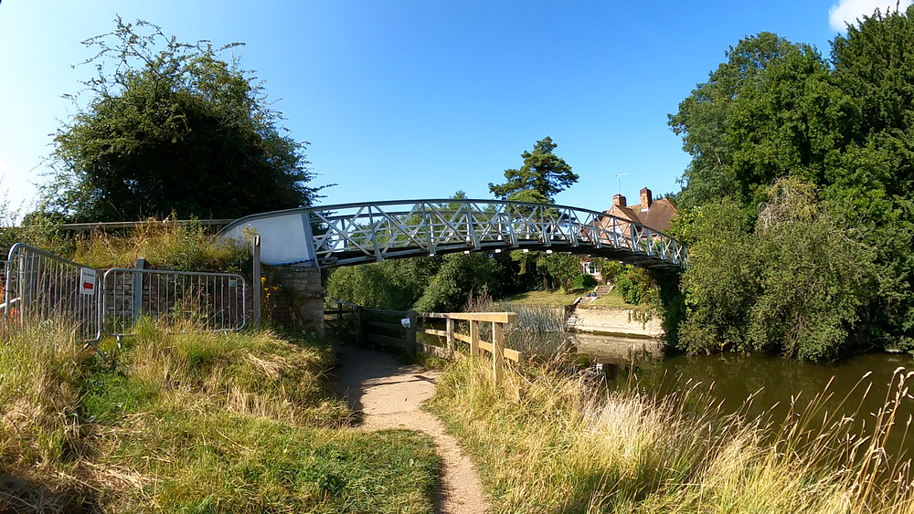
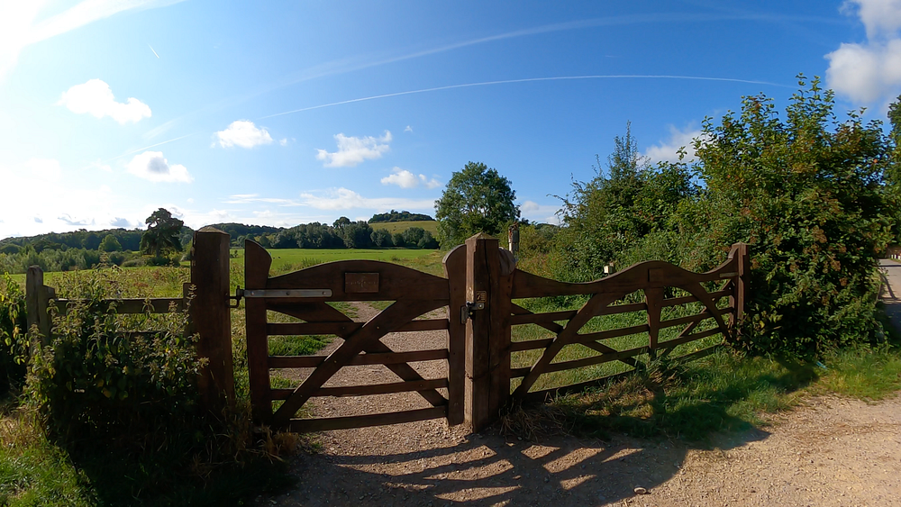
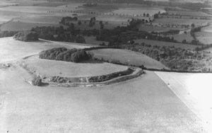
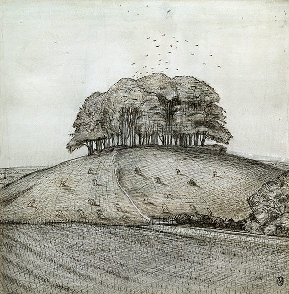

I love to take _Perspectief_ (my Dutch cruiser) downstream from Oxford to a favourite mooring near to Dorchester-on-Thames. The great thing about this location is that there are some wonderful walks around the village and, as you will see, a serious climb up to the top of Wittenham Clumps.

**Wittenham Clumps** are a pair of wooded chalk hills in the Thames Valley, in near to the village of Little Wittenham.

A beautiful walk that involves a bit of climb, but the view is worth it!

<!--and-->

## Let’s Start the Walk and make some observations along the way.

<iframe src="https://www.google.com/maps/d/embed?mid=1sRPlXhDtAkV-31W6iiBH_aMg154eae2Q&ehbc=2E312F" width="640" height="480"></iframe>

To begin with we need to make our way along the towpath of the going upstream towards Day’s Lock.

There are some lovely trees between the towpath and the river and this one is particularly impressive.

### Pooh Sticks Bridge

Quite soon we come to the footbridge across the Thames. This bridge was used for many years to hold Pooh Sticks Championships [^1].

<iframe width="560" height="315" src="https://www.youtube.com/embed/blF9KoI3BxE?si=emLTE8uvr3C-34vH" title="YouTube video player" frameborder="0" allow="accelerometer; autoplay; clipboard-write; encrypted-media; gyroscope; picture-in-picture; web-share" referrerpolicy="strict-origin-when-cross-origin" allowfullscreen></iframe>

### What do see after the Bridge?

After the bridge we are effectively on an island formed by the 2 streams; the main navigable Thames and the streams that rejoin a little further down. Up a steep walk (although made for cars to reach the lock keeper’s house), we come to St Peters Church, Little Wittenham. This charming parish church of Saint Peter has a 14th-century west bell tower.

Across from the Church we enter through a gate. This means we are entering the land managed by the [Earth Trust](https://earthtrust.org.uk/).

Press enter or click to view image in full size

Relax and enjoy this gentle walk up the hill. We pause and take a long look at the wild flowers.

<iframe width="560" height="315" src="https://www.youtube.com/embed/reRVdrjANpU?si=-h6nclw2j70IIjsi" title="YouTube video player" frameborder="0" allow="accelerometer; autoplay; clipboard-write; encrypted-media; gyroscope; picture-in-picture; web-share" referrerpolicy="strict-origin-when-cross-origin" allowfullscreen></iframe>

### Iron Age Fort

We only climbed to the top of the tallest ‘Clump’ on this occasion but it is worth taking a good look at the lower of the 2 hills which has on top an Iron Age fort. This was photographed by Major George Allen in 1939 during his last flight taking aerial photographs. Major George Allen was a pioneer of aerial photography and his photographs are held in the Ashmolean Museum in Oxford.

### Inspiration for Artists

**Paul Nash (1889 -1946)** was inspired by the hills and he made ipressive works including this ink and wash drawing:

Please see more information on the [Paul Nash web site](https://www.nashclumps.org/) devoted to Nash and The Clumps:

### Time to Walk Back

Join me as I go back over (and under) the bridge and along the towpath to find _Perspectief_ tucked in to her safe mooring.

<iframe width="560" height="315" src="https://www.youtube.com/embed/jiRmElCyj2I?si=qMz4wAxxkat3LrGF" title="YouTube video player" frameborder="0" allow="accelerometer; autoplay; clipboard-write; encrypted-media; gyroscope; picture-in-picture; web-share" referrerpolicy="strict-origin-when-cross-origin" allowfullscreen></iframe>

This post was first published in my *Medium* channel. I am now republishing these articles on my own web site. Enjoy!

[^1]: Poohsticks is a game first mentioned in The House at Pooh Corner , a Winnie-the-Pooh book by A. A. Milne.