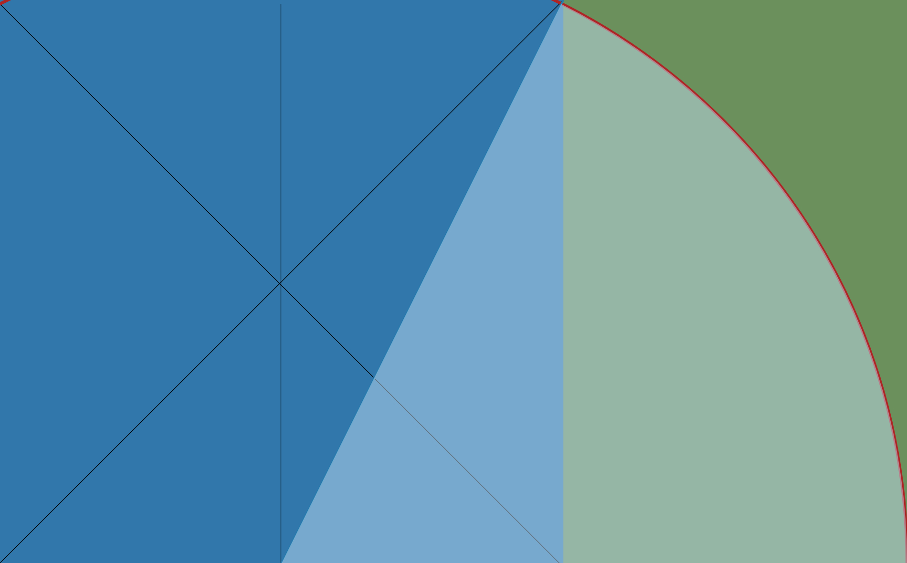

### Proportions of rectangles

In my current work, I use very specific rectangles that are defined by their precise proportions. The rectangles themselves form overall structure and the shapes within them emphasise these proportions. While I do not wish to limit my work to these proportions, the structures and geometry keeps me 
focussed on my main objective; building images from photo collected colours.

<!--and-->

#### Divine Proportion or the Golden Rectangle

In this series the landscape shaped pieces are using the _golden ratio_. The ratio between the long and the short side is 1.61803. To be precise, this should be (1+√5)/2.

The golden ratio rectangle is one of many _dynamic rectangles_ that can be rationally divided into visually interesting shapes.

Watch this animated gif to see how to  construct a golden rectangle:

- From a square divide vertically with a centre line.
- draw a diagonal from the centre point of the bottom line
- the resultant line forms the radius of a circle
- now extend the bottom line to meet this circle
- this then forms the long side of the rectangle

Here is an [example](https://www.chrisjennings.net/portfolio/sea-colours/) from this series:

#### Root2 A Size

In this series the ‘A’ size is used but in a portrait or landscape format. The long side of the rectangle is formed by taking an arc with radius of the diagonal of the square; where this meets the extended line side of the square.

The ratio of the sides of this rectangle is √2 or 1.4142. This rectangle forms the basis of the ‘A’ size, a European standard paper size with A0 being the largest.

Here is how we construct a **√2** rectangle (see this animated gif):

This is a somewhat simpler construct as follows:
- with a square draw a diagonal line
- this line forms the radius of a circle
- extend the bottom line of the square to meet this circle
- this line then becomes the longer side of the rectangle

Here is an example from this series:

Because the proportions of the rectangles are a very important aspect of my work, I don't like posting on some websites where the images are cropped.
For example, *Substack* and *Medium* (platforms that I have tried), are restricted to the proportion **1.5:1** and this means that they are cropped to 800x600 pixels (depending on the screen size).

Some sites that love to host your work will give you a square image whatever you give them and I try to avoid those sites. 

**Instagram** gives you the option of using the original proportions when uploading but your home page will give a grid of squares.

