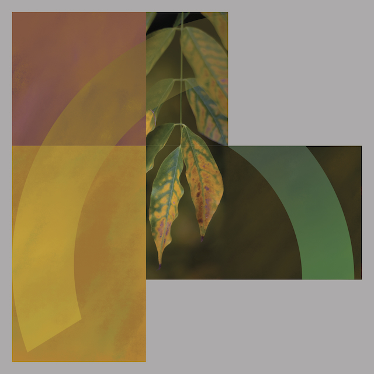

The wisteria arc in our Oxford garden, is the last of the colours to change for Autumn. The leaves turn from brilliant green to bright yellow and also display some dramatic orange hues before falling to the ground.

I am always looking for colours with my camera and on this occasion I didn't have to go far. I was able to get in quite close with a 40mm lens opened up to f1.2, putting the background well out of focus.

<!--and-->

I am using another variation of the 3 rectangle structure. This will be an A3 print on Hahnemühle 310gm German Etching paper as well as a wall construction 915mm square.

